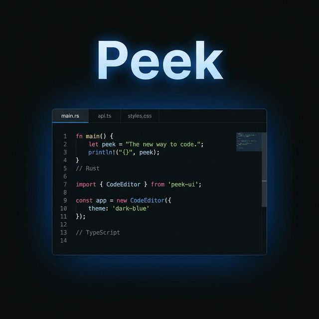

<p align="center">
  
</p>

<h1 align="center">Peek</h1>

<p align="center">
  <strong>A lightweight, native code editor built with Rust and React.</strong>
</p>

<p align="center">
  <a href="#features">Features</a> •
  <a href="#installation">Installation</a> •
  <a href="#keyboard-shortcuts">Shortcuts</a> •
  <a href="#architecture">Architecture</a> •
  <a href="#building-from-source">Build</a> •
  <a href="#contributing">Contributing</a> •
  <a href="#license">License</a>
</p>

<p align="center">
  
  
  
  
</p>

---

Peek is a fast, cross-platform file viewer and code editor that launches instantly and stays out of your way. Built on [Tauri v2](https://tauri.app) with a Rust backend and React frontend, it delivers native performance in a **~5 MB** binary.

## Features

### Editor
- **Syntax Highlighting** — 30+ languages via [highlight.js](https://highlightjs.org/), with Web Worker offloading for large files
- **Multi-Cursor Editing** — `Ctrl+D` to select next occurrence, type/delete at all cursors simultaneously
- **Search & Replace** — `Ctrl+F` with match highlighting, navigation, and bulk replace
- **Mini-Map** — Visual overview of your file with click-to-scroll navigation
- **Undo/Redo** — Full history stack with `Ctrl+Z` / `Ctrl+Shift+Z`
- **Line Numbers** — Toggleable, synced to scroll position
- **Word Wrap** — Toggleable soft wrapping
- **Configurable** — Font size, tab size, and theme preferences saved to disk

### File Handling
- **Tabbed Interface** — Open multiple files, switch with `Ctrl+PageUp/Down`
- **Drag & Drop** — Drop files directly onto the window
- **Large File Support** — Virtualized scrolling for files >2 MB with chunk-based editing
- **Binary Detection** — Magic-byte detection prevents accidental binary corruption
- **Atomic Saves** — Write → Sync → Rename pattern prevents data loss on crash
- **External Change Detection** — Warns when a file has been modified outside the editor
- **Auto-Save Drafts** — Recoverable drafts saved to localStorage

### Viewers
- **Markdown** — Split-pane preview with live rendering (Edit | Preview | Split)
- **Images** — Clean dark backdrop viewer
- **JSON** — Pretty-printed with syntax highlighting
- **Diff** — Side-by-side comparison of unsaved changes vs. disk

### Tools
- **OmniBar** — `Ctrl+P` for quick file switching, `:line` jump, and `>command` execution
- **Integrated Terminal** — Full PTY-backed terminal (bash/zsh) that opens in the file's directory
- **Diff Viewer** — Compare current edits against the saved version on disk
- **Settings Panel** — Theme picker, editor config, and keyboard shortcut reference

### Themes
Peek ships with **5 built-in themes**:

| Theme | Style |
|-------|-------|
| Midnight | Deep dark theme (default) |
| Dracula | Purple/cyan dark theme |
| Nord | Arctic blue palette |
| Solarized Dark | Warm dark theme |
| GitHub Light | Clean light theme |

---

## Installation

### Pre-built Binaries

Download the latest release for your platform from the [Releases](https://github.com/bart/peek/releases) page.

| Platform | Format |
|----------|--------|
| **Debian / Ubuntu** | `.deb` (~2.5 MB) |
| **Fedora / RHEL** | `.rpm` (~2.5 MB) |
| **Linux (Universal)** | `.AppImage` |
| **macOS** | `.dmg` |
| **Windows** | `.msi` |

#### Linux (Debian/Ubuntu)
```bash
sudo dpkg -i peek_0.1.0_amd64.deb
```

#### Linux (AppImage)
```bash
chmod +x peek_0.1.0_amd64.AppImage
./peek_0.1.0_amd64.AppImage
```

---

## Keyboard Shortcuts

| Shortcut | Action |
|----------|--------|
| `Ctrl+O` | Open file |
| `Ctrl+S` | Save file |
| `Ctrl+W` | Close tab |
| `Ctrl+P` | Quick Open (OmniBar) |
| `Ctrl+P` then `:` | Jump to line |
| `Ctrl+P` then `>` | Run command |
| `Ctrl+F` | Find & Replace |
| `Ctrl+D` | Add next occurrence (multi-cursor) |
| `Ctrl+Z` | Undo |
| `Ctrl+Shift+Z` | Redo |
| `Ctrl+,` | Settings |
| `` Ctrl+` `` | Toggle terminal |
| `Ctrl+PageDown` | Next tab |
| `Ctrl+PageUp` | Previous tab |
| `Escape` | Close overlay / exit multi-cursor |

---

## Architecture

Peek uses a hybrid architecture combining Rust for system-level operations with React for the UI layer.

```
┌────────────────────────────────────────────────────┐
│                    Tauri WebView                    │
│                                                    │
│  ┌──────────┐  ┌──────────┐  ┌──────────────────┐ │
│  │  TabBar   │  │ OmniBar  │  │  SettingsPanel   │ │
│  └──────────┘  └──────────┘  └──────────────────┘ │
│  ┌────────────────────────────────────────────────┐│
│  │              CodeEditor                        ││
│  │  ┌────────┬────────────────────┬──────────┐   ││
│  │  │Line Nos│ Textarea + Overlay │ MiniMap  │   ││
│  │  └────────┴────────────────────┴──────────┘   ││
│  └────────────────────────────────────────────────┘│
│  ┌────────────────────────────────────────────────┐│
│  │            TerminalPanel (xterm.js)            ││
│  └────────────────────────────────────────────────┘│
└──────────────────┬─────────────────────────────────┘
                   │ Tauri IPC (invoke)
┌──────────────────▼─────────────────────────────────┐
│                Rust Backend                         │
│                                                     │
│  ┌─────────────────┐  ┌─────────────────────────┐  │
│  │   lib.rs         │  │   terminal.rs           │  │
│  │                  │  │                          │ │
│  │  • read_file     │  │  • spawn_terminal       │  │
│  │  • safe_save     │  │  • write_terminal       │  │
│  │  • read_chunk    │  │  • resize_terminal      │  │
│  │  • patch_chunk   │  │  • kill_terminal        │  │
│  │  • get_metadata  │  │                          │ │
│  └─────────────────┘  └─────────────────────────┘  │
└─────────────────────────────────────────────────────┘
```

### Tech Stack

| Layer | Technology | Purpose |
|-------|-----------|---------|
| **Runtime** | [Tauri v2](https://tauri.app) | Native window + IPC bridge |
| **Backend** | Rust | File I/O, terminal (PTY), atomic saves |
| **Frontend** | React 19 + TypeScript | UI components and state |
| **Build** | Vite 7 | HMR dev server + production bundling |
| **Styling** | Vanilla CSS | Zero-runtime CSS variable theming |
| **Highlighting** | highlight.js | Syntax highlighting (30+ languages) |
| **Terminal** | xterm.js + portable-pty | Integrated terminal emulator |
| **Diffing** | diff (npm) | Unified diff computation |

### Key Design Decisions

- **Textarea overlay pattern** — The editor uses a transparent `<textarea>` for native input handling, layered over a `<div>` that renders syntax-highlighted code. This gives us browser-native cursor behavior, IME support, and accessibility while maintaining full visual control.
- **Web Worker highlighting** — Files >50 KB offload syntax highlighting to a Web Worker to prevent UI jank during typing.
- **Atomic saves** — All file writes go through a `write → fsync → rename` pipeline to prevent data loss if the process crashes mid-save.
- **Content ref pattern** — Event handlers access content via `useRef` to avoid re-binding listeners on every keystroke.

---

## Building from Source

### Prerequisites

- [Rust](https://rustup.rs/) (stable)
- [Node.js](https://nodejs.org/) (v18+)
- [pnpm](https://pnpm.io/)
- System dependencies for Tauri (see [Tauri prerequisites](https://v2.tauri.app/start/prerequisites/))

### Development

```bash
# Clone the repository
git clone https://github.com/bart/peek.git
cd peek

# Install frontend dependencies
pnpm install

# Start development server (hot-reload)
pnpm tauri dev
```

### Production Build

```bash
pnpm tauri build
```

Output binaries are placed in `src-tauri/target/release/bundle/`.

### Project Structure

```
peek/
├── src/                    # React frontend
│   ├── components/         # UI components (20 files)
│   │   ├── CodeEditor.tsx  # Main editor (textarea overlay)
│   │   ├── OmniBar.tsx     # Quick open / command palette
│   │   ├── TerminalPanel.tsx
│   │   ├── MiniMap.tsx
│   │   ├── SearchOverlay.tsx
│   │   ├── SettingsPanel.tsx
│   │   └── ...
│   ├── hooks/              # Custom React hooks
│   │   ├── useHistory.ts   # Undo/redo stack
│   │   ├── useMultiCursor.ts
│   │   ├── useSettings.ts
│   │   └── useAutoSave.ts
│   ├── lib/
│   │   └── themes.ts       # Theme definitions (8 themes)
│   ├── worker.ts           # Web Worker for syntax highlighting
│   ├── App.tsx             # Main application controller
│   └── App.css             # All styles (~1500 lines)
├── src-tauri/              # Rust backend
│   ├── src/
│   │   ├── lib.rs          # Tauri commands & file operations
│   │   └── terminal.rs     # PTY terminal management
│   ├── Cargo.toml
│   └── tauri.conf.json
├── package.json
└── vite.config.ts
```

---

## Contributing

Contributions are welcome! Here's how to get started:

1. **Fork** the repository
2. **Create** a feature branch (`git checkout -b feature/amazing-feature`)
3. **Commit** your changes (`git commit -m 'Add amazing feature'`)
4. **Push** to the branch (`git push origin feature/amazing-feature`)
5. **Open** a Pull Request

### Areas for Contribution

- 🎨 New themes
- 🌐 Language support improvements
- 🐛 Bug fixes
- 📖 Documentation
- ⌨️ New keyboard shortcuts and commands
- 🔌 Plugin system architecture

---

## License

This project is licensed under the [MIT License](LICENSE).

---

<p align="center">
  <sub>Built with ❤️ using <a href="https://tauri.app">Tauri</a>, <a href="https://react.dev">React</a>, and <a href="https://www.rust-lang.org">Rust</a></sub>
</p>
